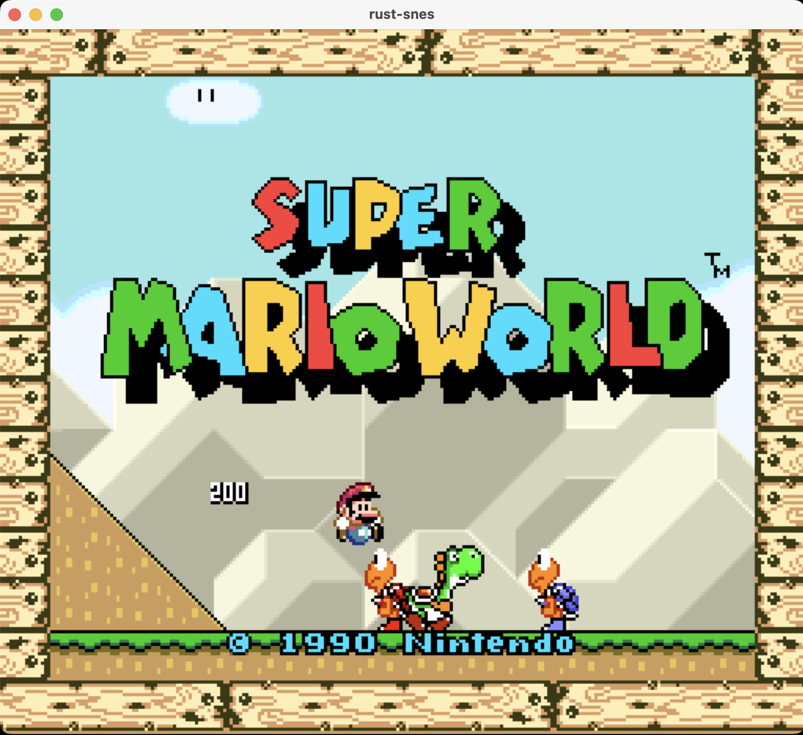

# rust-snes

An SNES emulator written in Rust.

## Overview

This project is an SNES emulator written in Rust that emulates the hardware of the original console. It includes implementations of the CPU, Picture Processing Unit (PPU), audio system (S-SMP), and other core components necessary to run classic SNES games accurately.

## Gameplay Examples



## Features
- **CPU Emulation**: The emulator includes an implementation of the Ricoh 5A22 CPU, which is the processor used in the SNES. The CPU is responsible for executing the instructions of the game code and interacting with the other components of the system.
- **Graphics Emulation**: The emulator includes an implementation of the Picture Processing Unit (PPU), which is responsible for rendering the graphics of the game. The PPU is capable of rendering backgrounds, sprites, and other graphical elements of the game.
- **Audio Emulation**: The emulator includes an implementation of the S-SMP audio system, which is responsible for generating sound effects and music in the game. The audio system is capable of playing back audio samples and generating sound effects in real-time.
- **Cross-Platform Support**: The emulator is designed to run on multiple platforms, including Windows, macOS, and Linux. The emulator is written in Rust, which allows it to be compiled and run on a wide range of systems.

## Getting Started

### Prerequisites

To build and run rust-snes, you will need the following:

- [Rust](https://www.rust-lang.org/tools/install) (latest stable version)
- [Cargo](https://doc.rust-lang.org/cargo/getting-started/installation.html) (Rust's package manager)

### Basic Example
```bash
cargo run --release --bin snes -- path/to/rom.sfc
```
### Keyboards Controls
- **Arrow keys**: D-pad (Up, Down, Left, Right)
- **X Key**: A button
- **Z Key**: B button
- **S Key**: X button
- **A Key**: Y button
- **Q Key**: L button
- **W Key**: R button
- **Enter Key**: Start button
- **Left Shift Key**: Select button


## TODO
- **SA-1 support**: The SA-1 is a co-processor that was used in a few SNES games to enhance performance. Implementing support for the SA-1 would allow more games to be played on the emulator.